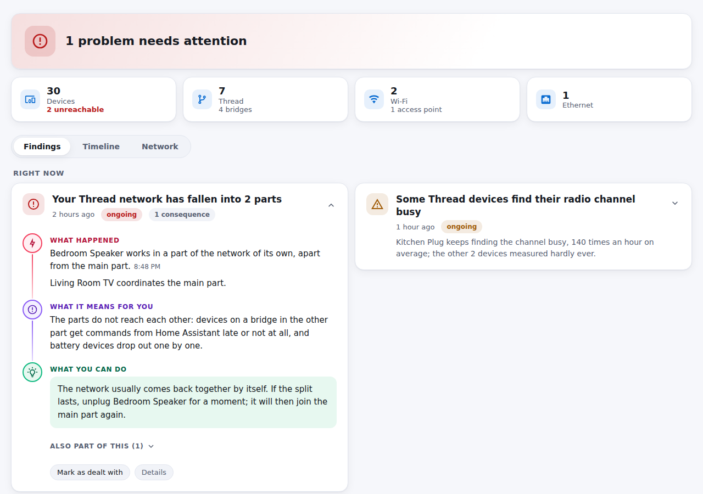
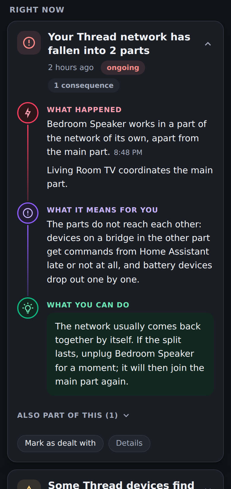
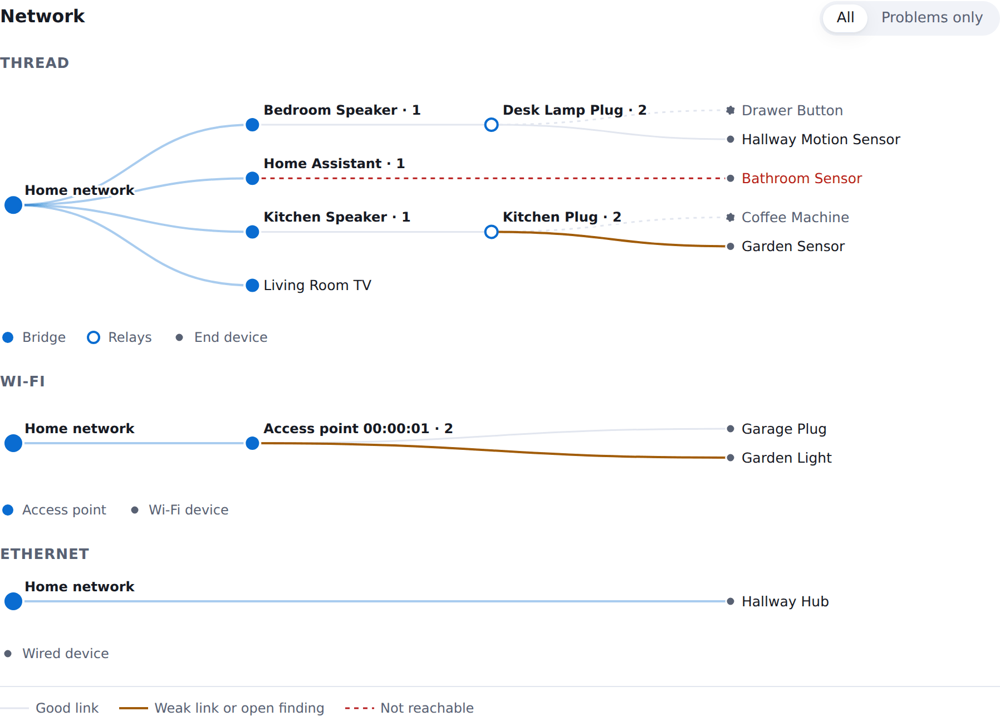

# Matter Health

A Home Assistant add-on that explains why Matter and Thread devices
misbehave, in words anyone can follow.

> **Experimental.** It has been used on one home so far. What it tells is
> meant to be right; where it is not, an issue with what you saw helps most.

Matter over Thread fails quietly. A plug refuses to pair at "Configuring", a
sensor drops out every other night, a switch reacts a second late. Home
Assistant shows that something is wrong, rarely why. Matter Health watches the
Matter Server, the OpenThread Border Router and Home Assistant at the same
time, connects what happens across them and tells you:

- **why**: "The plug your TV box is on was switched off. The TV box was
  coordinating your Thread network."
- **what happened**: "Your Thread network fell apart for 40 seconds."
- **what it means for you**: "Devices could not be reached, and adding a
  device failed in the meantime."
- **what to do**: "Keep border routers on a plug that is never switched off."

Technical detail is one click away, for whoever wants it.

  
  &nbsp;
  

  

The network is drawn as one picture, whatever connects it - Thread, Wi-Fi,
Ethernet, Matter bridges: every device on the one way it takes in, so a weak
link or a device gone shows where it hangs.

The screenshots show invented data from `scripts/demo.py`.

## What it recognises

| Situation                         | Example of what you read                                 |
|-----------------------------------|----------------------------------------------------------|
| Thread network splits or reorganises | which border router disappeared, and what switched it off |
| A border router on a switched plug | the plug, once off-gone-on-back has happened twice      |
| Adding a device fails             | the step in plain words, and what usually helps there    |
| A device has a weak connection    | the device, its nearest neighbour and the signal         |
| A device stays unreachable        | whether the network or the power is the likelier reason  |
| The Thread network stays split    | the bridges cut off, and which one coordinates the rest  |
| The radio channel is busy         | measured by the devices: everywhere or around a few, and an own access point on a neighbouring Wi-Fi channel |

Every rule is its own module. New knowledge becomes a new rule, without
touching the rest; see [docs/architecture.md](docs/architecture.md).

## Requirements

- Home Assistant OS or Supervised, with the **Matter Server** add-on.
- The **OpenThread Border Router** add-on is optional; without it, Thread
  network events come only from the Matter Server.

## Installation

1. Click the **Add repository** button at the top, or in Home Assistant open
   **Settings → Add-ons → Add-on Store**, then **⋮ → Repositories**, and add
   `https://github.com/skjall/home-assistant-matter-health`.
2. Install **Matter Health** and start it.
3. Open it from the sidebar.

It starts recording when it starts. Problems that happened before are not
known to it.

## Privacy

Everything stays on your Home Assistant host. Matter Health reads logs and
state; it never changes a device, the network or another add-on. It never
reads the Thread network key. It reaches nothing outside Home Assistant:
what it knows about your home network, it takes from integrations you
already have, such as UniFi Network.

## Languages

English, German, French, Spanish. The page follows the language set in your
Home Assistant profile.

## Development

See [CONTRIBUTING.md](CONTRIBUTING.md).

## License

[MIT](LICENSE)
